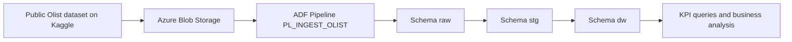

[Espanol](./README.es.md) | [Language selector](./README.md)

# Olist Data Warehouse Project

This project recreates an end-to-end data workflow using the public Olist dataset available on Kaggle. The solution was built as a portfolio project to demonstrate a complete implementation of ingestion, cleaning, transformation, dimensional modeling, and business analysis using SQL Server and Azure as the entry point for the initial load.

The main idea behind the project was not to stop at flat-file querying or isolated exploratory analysis, but to simulate an architecture closer to a real analytics environment. To do that, the data was organized into separate layers with clearly defined responsibilities: a `raw` layer to receive the data as it arrives from the source, a `stg` layer to clean and type the data, and a `dw` layer to consolidate the final analytical model.

## Project goal

The main goal was to build a small data ecosystem oriented toward reporting and analytics for the Olist e-commerce business. From a technical perspective, the project is meant to showcase skills in:

- ingestion pipeline design
- layered data modeling
- data cleaning and normalization
- T-SQL transformations
- dimension and fact table design
- business metric definition
- analytical query development for reporting

From a portfolio perspective, the project reflects a structured way of working with data: first ensuring traceability of the raw data, then applying quality rules, and finally exposing a model capable of answering business questions.

## Solution context

The Olist dataset contains information related to customers, orders, items, payments, reviews, products, sellers, and geolocation. Even though the data is public and relatively accessible, it is not ready for direct analytical consumption. There are type inconsistencies, state abbreviations, inconsistent city names, dates stored as text, and relationships that require transformation in order to build reliable indicators.

For that reason, the solution was designed as a layered ETL flow:

1. The data is first loaded into `raw` tables, preserving the original format from the source.
2. It is then moved into `stg` tables, where data types, formats, and values are corrected.
3. Finally, it is loaded into the `dw` schema, where the data is organized into dimensions and facts for analysis.
4. KPI and reporting queries are executed on top of the dimensional model.

## Overall architecture



This architecture follows a simple but very useful logic:

- `raw` protects source fidelity
- `stg` concentrates cleaning and standardization
- `dw` enables analytical consumption

Separating the layers improves maintainability, makes debugging easier, and gives each step a clear purpose within the overall flow.

## Technologies used

- SQL Server
- T-SQL
- Azure Data Factory
- Azure Blob Storage
- Kaggle as the source of the public Olist dataset

## Repository structure

```text
Olist/
|-- Create tables/
|   |-- Create Raw tables.sql
|   |-- Create Staging tables.sql
|   `-- Create Data warehouse tables.sql
|-- Functions/
|   `-- fn_clean_city.sql
|-- Insert data/
|   |-- insert_staging.sql
|   `-- insert_data_warehouse.sql
|-- olist_business_kpis.sql
|-- README.md
|-- README.es.md
`-- README.en.md
```

## Project workflow

### Ingestion in Azure Data Factory

The initial load into the `raw` layer is not presented as a manual import of files, but as a formal Azure Data Factory pipeline documented in the `PL_INGEST_OLIST` definition. This makes the project stronger from a portfolio perspective because it shows real concern for orchestration, parameterization, and reuse of the ingestion process.

The `PL_INGEST_OLIST` pipeline is designed to load the Olist CSV files from Azure storage into tables in the `raw` schema in SQL Server. The logic relies on `Copy` activities, a parameterized `ForEach`, and specific rules for datasets that require special handling.

#### Main pipeline activities

The pipeline contains three relevant blocks:

- `CP_LOAD_REVIEWS_CLEAN`
- `CP_LOAD_TRANSLATION_CLEAN`
- `FE_LOAD_RAW_TABLES`

The current execution sequence is:

1. `CP_LOAD_REVIEWS_CLEAN` runs first.
2. `CP_LOAD_TRANSLATION_CLEAN` runs next.
3. `FE_LOAD_RAW_TABLES` runs last and iterates sequentially through the generic file list.

This structure shows that not every file was treated the same way. Some required dedicated loading logic because of source-specific issues, while the rest could be handled through a reusable and parameterized pattern.

#### Dedicated review load

The `CP_LOAD_REVIEWS_CLEAN` activity loads the `olist_order_reviews_dataset.csv` file into `raw.order_reviews`. What makes it important is that it does not rely only on automatic conversion, but also uses explicit column mappings in the `TabularTranslator`.

This was necessary because the reviews file contains an anomaly in one of its headers: `review_answer_timestamp` has a trailing line break in the source. In the pipeline definition it appears as `review_answer_timestamp\r`.

Documenting this activity in the README matters because it shows that the pipeline does not simply move files around. It also addresses concrete defects in the source during ingestion.

#### Dedicated category translation load

The `CP_LOAD_TRANSLATION_CLEAN` activity inserts the translation dataset into `raw.product_category_name_translation`. This file is handled separately because it plays a reference role in the project: it does not represent a business transaction, but a catalog later used to enrich the `stg` layer and the product dimension in `dw`.

In other words, this activity prepares one of the most important inputs for category standardization and for making the final model easier to consume analytically.

#### Generic and parameterized load for the remaining raw tables

The `FE_LOAD_RAW_TABLES` activity wraps a sequential `ForEach` over the `file_list` parameter. Inside that loop, the `CP_LOAD_GENERIC_CSV` activity executes the same copy pattern for multiple dataset files.

The files currently defined in `file_list` are:

- `olist_orders_dataset.csv`
- `olist_customers_dataset.csv`
- `olist_order_items_dataset.csv`
- `olist_products_dataset.csv`
- `olist_order_payments_dataset.csv`
- `olist_sellers_dataset.csv`
- `olist_geolocation_dataset.csv`

Each item in the list includes the file name and the destination table. Because of this, the pipeline avoids repeating one `Copy` activity per CSV and makes ingestion more maintainable, cleaner, and easier to extend if new entities are added later.

#### Technical configuration of Copy activities

From an operational perspective, the pipeline uses components and settings worth highlighting:

- `DelimitedTextSource` as the source
- reads from Azure Blob Storage
- `SqlServerSink` as the destination
- `insert` write behavior
- `enableSkipIncompatibleRow` enabled to tolerate problematic rows
- type conversion enabled through `TabularTranslator`
- truncation allowed when needed
- activity logging enabled at `Warning` level

These decisions reflect a pragmatic ingestion strategy: prioritize load continuity, record useful warnings, and leave the more semantic cleanup for the `stg` layer.

### 1. Raw layer: receiving the original data

The first layer of the project is designed to receive the data without applying too many validation rules at the moment of ingestion. In [`Create tables/Create Raw tables.sql`](./Create%20tables/Create%20Raw%20tables.sql), tables are created such as:

- `raw.customers`
- `raw.geolocation`
- `raw.order_items`
- `raw.order_payments`
- `raw.order_reviews`
- `raw.orders`
- `raw.products`
- `raw.sellers`
- `raw.product_category_name_translation`

In this layer, almost all columns are defined as `VARCHAR`. This decision is intentional. In an initial ingestion process, storing the data temporarily as text helps:

- avoid load failures caused by unexpected formats
- preserve the original data for auditing or reprocessing
- decouple ingestion from transformation

This also aligns well with the Azure Data Factory pipeline. By loading first into flexible `raw` tables, the process reduces the risk of ingestion failures caused by type issues too early in the flow, especially with files that contain dirty details or irregular headers.

In other words, the `raw` layer acts as a landing zone. Its priority is to capture source information with as little friction as possible, even if the data is not yet suitable for analysis.

### 2. Staging layer: cleaning, conversion, and standardization

The second layer is defined in [`Create tables/Create Staging tables.sql`](./Create%20tables/Create%20Staging%20tables.sql). At this point, the goal is no longer to simply replicate the source, but to model tables with data types that are more appropriate for analytical work.

For example:

- latitude and longitude are converted to `DECIMAL`
- prices and monetary values are converted to `FLOAT`
- numeric fields such as quantities and sequences are converted to `NUMERIC`
- dates and timestamps are converted to `DATE` or `DATETIME`

This layer serves a key purpose: transforming a set of operational files into a structured, consistent dataset ready to be integrated into a dimensional model.

The load from `raw` to `stg` is performed in [`Insert data/insert_staging.sql`](./Insert%20data/insert_staging.sql). This script concentrates much of the project's data quality logic and is the point where technical ingestion becomes analytical transformation.

#### Transformations applied in staging

Among the most important transformations are:

- data type conversion with `TRY_CONVERT`
- rounding of monetary amounts in prices and freight
- normalization of city names
- translation and enrichment of product categories
- expansion of Brazilian state abbreviations into full state names
- cleanup of timestamps with invisible characters or problematic formats

#### Customer cleanup

In the customer table, the city format is standardized to improve presentation and join consistency. In addition, abbreviated state codes are translated into full names such as `Sao Paulo`, `Rio de Janeiro`, or `Minas Gerais`.

This makes the data easier to read for analysis and avoids making downstream consumption depend on external lookup dictionaries.

#### Geographic cleanup with a custom function

One of the most interesting components of the project is the [`Functions/fn_clean_city.sql`](./Functions/fn_clean_city.sql) function, created to clean city names before loading the `stg.geolocation` table.

The `dbo.fn_clean_city` function solves several data quality issues in the dataset:

- handling `NULL` values
- removing defective patterns
- replacing special characters
- normalizing accents
- removing numbers embedded in city names
- trimming text at delimiters such as commas, parentheses, or hyphens
- removing duplicate spaces
- cleaning non-alphabetic leading characters

This step is very important because geolocation data often contains variations, typos, or textual noise. If those names are not cleaned, relationships with customers or sellers can become inconsistent and geographic analysis loses quality.

#### Order and review cleanup

Orders and reviews contain date and time fields that originally arrive as text. In staging, they are converted with `TRY_CONVERT` into valid temporal types. In the case of reviews, the script also handles invisible characters from the source before converting the response timestamp.

This makes it possible to:

- calculate delivery times
- compare estimated dates against actual dates
- analyze purchase timing
- relate customer experience to logistics performance

#### Product category translation

Products are enriched using the `raw.product_category_name_translation` table, the same one loaded through the dedicated `CP_LOAD_TRANSLATION_CLEAN` activity in Azure Data Factory. This allows original category names in Portuguese to be converted into a more interpretable representation for business users or analysts who prefer English naming.

Additionally, the script documents that some missing categories had to be added manually, which is actually a positive sign from a portfolio perspective: it shows that the project was not limited to automatic loading, but also involved identifying and resolving small gaps in the source.

### 3. Data warehouse layer: dimensional model for analytics

The final layer is defined in [`Create tables/Create Data warehouse tables.sql`](./Create%20tables/Create%20Data%20warehouse%20tables.sql). This is where the project moves from a transactional or intermediate structure into a model oriented toward querying and analysis.

The `dw` schema includes:

#### Dimensions

- `dw.dim_customer`
- `dw.dim_product`
- `dw.dim_seller`
- `dw.dim_location`
- `dw.dim_date`

#### Fact tables

- `dw.fact_orders`
- `dw.fact_order_items`

The reason for building dimensions and facts is to separate descriptive attributes from quantitative metrics. This makes the model easier to query, more expressive for reporting, and more aligned with classic Business Intelligence practices.

### 4. Data warehouse loading

The logic for inserting data into the final model is in [`Insert data/insert_data_warehouse.sql`](./Insert%20data/insert_data_warehouse.sql). This script takes already cleaned data from `stg` and turns it into analytical structures ready for consumption.

#### Customer dimension

`dw.dim_customer` stores key customer information such as:

- `customer_id`
- `customer_unique_id`
- city
- state

Later, this dimension is enriched with `location_key`, connecting it to the geographic dimension and enabling territorial analysis.

#### Product dimension

`dw.dim_product` stores the product and its category. This is where the relationship between product identifier and classification is consolidated, enabling category analysis, top-product analysis, and revenue contribution analysis.

#### Seller dimension

`dw.dim_seller` represents sellers with city and state attributes. Just as with customers, a `location_key` is later assigned so commercial information can be analyzed from a geographic perspective.

#### Date dimension

`dw.dim_date` is built with a recursive CTE calendar covering the years from 2016 to 2020. This table is fundamental in any warehouse because it avoids recalculating temporal attributes in every query and makes it easy to analyze by:

- year
- month
- day
- month name

#### Location dimension

`dw.dim_location` groups geographic information by zip code prefix, city, and state, while also calculating average latitude and longitude. This approach summarizes multiple geolocation records into a more stable representation for analytical use.

#### Orders fact table

`dw.fact_orders` summarizes operations at the order level and includes business metrics such as:

- `total_order_value`
- `total_freight`
- `total_items`
- `delivery_days`
- `delivery_delay`
- `avg_review_score`

This table is especially valuable because it integrates data from several sources:

- orders
- order items
- reviews
- customers
- products
- sellers
- dates

The result is a consolidated view of each purchase, suitable for measuring revenue, volume, customer experience, and logistics performance.

#### Order items fact table

`dw.fact_order_items` keeps detail at the sold-item level. It stores:

- item price
- freight value
- total value per item

This enables more granular analysis, for example:

- highest-revenue categories
- best-selling products
- purchase combinations
- ticket distribution at item level

### 5. Geographic link between customers, sellers, and locations

An additional step in the project consists of adding `location_key` to the customer and seller dimensions. This decision is important because it decouples geographic description from the rest of the attributes and leaves the model ready for spatial or regional analysis.

Thanks to this link, the model can support views such as:

- sales by state
- average spend comparison by region
- geographic concentration of customers
- territorial distribution of sellers

## Business queries and KPIs

The analytical layer is documented in [`olist_business_kpis.sql`](./olist_business_kpis.sql). This file groups queries oriented toward reporting and business performance exploration.

The value of this layer is that it transforms the dimensional model into concrete answers to business questions. It is not only about storing data correctly, but about enabling useful analysis for decision-making.

### Main analytical areas covered

#### Revenue and growth

The file includes queries for:

- monthly sales
- order volume by period
- average ticket
- monthly percentage growth

These metrics help explain how the business evolves over time and reveal changes in trend.

#### Logistics performance

Indicators include:

- average delivery time
- percentage of late deliveries
- delivery time by state

This block connects operational performance with the impact it may have on customer experience.

#### Customer analytics

The file includes views for:

- top customers by spend
- Customer Lifetime Value
- retention cohorts
- RFM segmentation
- customer churn
- repeat rate

These queries make it possible to move from a transactional view to a relationship view of the customer, identifying recurrence, value, and churn risk.

#### Product analytics

The project includes queries for:

- highest-revenue categories
- best-selling categories
- average ticket by product
- market basket analysis
- Pareto-style cumulative contribution

This helps explain which products drive revenue and which ones tend to be purchased together.

#### Seller analytics

The project also includes indicators for:

- top sellers by revenue
- sellers with the weakest delivery performance

This helps identify both the strongest contributors to revenue and potential sources of operational friction.

#### Customer satisfaction

The project relates average review score to delivery time and segments logistics performance into categories such as:

- `On Time`
- `Slight Delay`
- `Severe Delay`

This combination is especially useful because it links customer experience to measurable operational variables.

#### Geographic analysis

The model supports queries such as:

- sales by state
- customer segmentation by location

This expands the value of customer, seller, and geolocation data by integrating them into a unified analytical framework.

## Recommended execution order

To rebuild the project from scratch, the suggested order is:

1. Create the `OlistDW` database if it does not already exist.
2. Create the `raw`, `stg`, and `dw` schemas.
3. Run [`Create tables/Create Raw tables.sql`](./Create%20tables/Create%20Raw%20tables.sql).
4. Run the `PL_INGEST_OLIST` pipeline in Azure Data Factory to load the source files into the `raw` tables.
5. Run [`Functions/fn_clean_city.sql`](./Functions/fn_clean_city.sql).
6. Run [`Create tables/Create Staging tables.sql`](./Create%20tables/Create%20Staging%20tables.sql).
7. Run [`Insert data/insert_staging.sql`](./Insert%20data/insert_staging.sql).
8. Run [`Create tables/Create Data warehouse tables.sql`](./Create%20tables/Create%20Data%20warehouse%20tables.sql).
9. Run [`Insert data/insert_data_warehouse.sql`](./Insert%20data/insert_data_warehouse.sql).
10. Run [`olist_business_kpis.sql`](./olist_business_kpis.sql) for the final analysis.

## What this project demonstrates

This project does not only show SQL queries. It shows a structured way of thinking about a complete data solution. In particular, it demonstrates experience in:

- organizing data in layers
- transforming raw data into analytical models
- creating reusable functions for data quality
- integrating dimensions and facts
- preparing datasets for reporting
- building business metrics for decision-making

It also shows judgment in handling real-world data issues, such as:

- dirty or inconsistent values
- formatting differences across tables
- the need to standardize geography
- semantic enrichment of categories
- consolidation of transactional events into business indicators

## Possible future improvements

As a natural evolution of the project, some future improvements could include:

- automating the full refresh pipeline
- adding views or stored procedures for recurring consumption
- adding data quality validations by layer
- documenting data volumes and execution times
- connecting the warehouse to Power BI for executive dashboards
- including reconciliation tests between `raw`, `stg`, and `dw`

## Author

Anthony Ccasani
