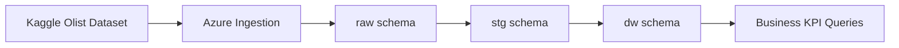

# Olist Data Warehouse Project

This project recreates an end-to-end data workflow using the public Olist e-commerce dataset from Kaggle. The goal is to build a portfolio-ready data solution that starts with raw data ingestion through Azure, continues with SQL-based cleaning and transformation, and ends with a dimensional model designed for business reporting and KPI analysis.

## Project Overview

The solution is structured in three layers:

- `raw`: landing zone for source data loaded from Azure
- `stg`: cleaned and typed staging layer for transformation
- `dw`: dimensional model for analytics and reporting

The project was built in SQL Server using T-SQL and follows a simple warehouse pattern:

1. Load source files into `raw` tables.
2. Clean and standardize the data in `stg`.
3. Populate dimensions and fact tables in `dw`.
4. Query business KPIs from the warehouse model.

## Architecture



## Data Model

### Raw Layer

The `raw` schema stores the source data with minimal processing. All columns are initially created as text fields to preserve the original format and simplify ingestion.

Raw tables:

- `raw.customers`
- `raw.geolocation`
- `raw.order_items`
- `raw.order_payments`
- `raw.order_reviews`
- `raw.orders`
- `raw.products`
- `raw.sellers`
- `raw.product_category_name_translation`

### Staging Layer

The `stg` schema standardizes the data model and prepares the dataset for analytics. At this stage, the project converts data types, rounds monetary fields, cleans city names, expands Brazilian state abbreviations, and translates product categories.

Main transformation examples:

- `VARCHAR` source columns are converted into `DATE`, `DATETIME`, `DECIMAL`, `NUMERIC`, and `FLOAT`
- city values are cleaned with `dbo.fn_clean_city`
- state codes such as `SP`, `RJ`, and `MG` are mapped to full state names
- product category names are translated to English using the translation table
- review timestamps are corrected with `TRY_CONVERT` and character cleanup

Staging tables:

- `stg.customers`
- `stg.geolocation`
- `stg.order_items`
- `stg.order_payments`
- `stg.order_reviews`
- `stg.orders`
- `stg.products`
- `stg.sellers`
- `stg.product_category_name_translation`

### Data Warehouse Layer

The `dw` schema contains a star-schema style model for reporting and analysis.

Dimensions:

- `dw.dim_customer`
- `dw.dim_product`
- `dw.dim_seller`
- `dw.dim_location`
- `dw.dim_date`

Facts:

- `dw.fact_orders`
- `dw.fact_order_items`

`dw.fact_orders` stores business-level metrics such as:

- `total_order_value`
- `total_freight`
- `total_items`
- `delivery_days`
- `delivery_delay`
- `avg_review_score`

`dw.fact_order_items` stores item-level transaction detail:

- `price`
- `freight_value`
- `total_value`

## Data Cleaning Function

The project includes the custom SQL function `dbo.fn_clean_city` to normalize city names before loading geographic data into staging.

This function performs tasks such as:

- null handling
- removal of malformed patterns and special characters
- accent normalization
- numeric character removal
- trimming at delimiters like commas, parentheses, and hyphens
- whitespace cleanup

This is especially useful for improving joins and consistency between geographic and customer or seller location data.

## ETL and Loading Logic

### 1. Raw Table Creation

The raw tables are created in:

- `Create tables/Create Raw tables.sql`

### 2. Staging Table Creation

The staging tables are created in:

- `Create tables/Create Staging tables.sql`

### 3. Warehouse Table Creation

The dimensional model is created in:

- `Create tables/Create Data warehouse tables.sql`

### 4. Staging Loads

The transformation and inserts from `raw` to `stg` are handled in:

- `Insert data/insert_staging.sql`

This script includes:

- customer standardization
- geolocation cleanup using `dbo.fn_clean_city`
- rounding of prices and freight values
- conversion of order and review dates
- translation of product categories
- seller normalization

The script also contains setup notes for:

- creating the `OlistDW` database
- creating the Azure connection user
- creating the `raw`, `stg`, and `dw` schemas

### 5. Warehouse Loads

The inserts from `stg` to `dw` are handled in:

- `Insert data/insert_data_warehouse.sql`

This script populates:

- customer, product, seller, date, and location dimensions
- order-level and item-level fact tables

It also enriches customer and seller dimensions with `location_key` using the location dimension.

### 6. KPI and Reporting Queries

Business analysis queries are available in:

- `olist_business_kpis.sql`

According to the script header, the KPI layer was authored by Anthony Ccasani.

## Business Analysis Covered

The KPI script includes queries for:

- monthly revenue and order growth
- delivery performance and late delivery rate
- customer lifetime value and top customers
- top product categories and best-selling products
- seller performance and delivery issues
- satisfaction analysis using review scores
- business funnel metrics
- geographic sales analysis
- cohort retention analysis
- RFM segmentation
- churn identification
- delivery performance segmentation
- market basket analysis
- Pareto contribution analysis
- customer segmentation by location
- repeat customer rate
- average order value distribution

## Repository Structure

```text
Olist/
|-- Create tables/
|   |-- Create Raw tables.sql
|   |-- Create Staging tables.sql
|   `-- Create Data warehouse tables.sql
|-- Functions/
|   `-- fn_clean_city.sql
|-- Insert data/
|   |-- insert_staging.sql
|   `-- insert_data_warehouse.sql
|-- olist_business_kpis.sql
`-- README.md
```

## Execution Order

If you want to reproduce the project from scratch, run the scripts in this order:

1. Create the database and schemas if needed.
2. Run `Create tables/Create Raw tables.sql`.
3. Load the Olist source data into the `raw` tables through Azure.
4. Run `Functions/fn_clean_city.sql`.
5. Run `Create tables/Create Staging tables.sql`.
6. Run `Insert data/insert_staging.sql`.
7. Run `Create tables/Create Data warehouse tables.sql`.
8. Run `Insert data/insert_data_warehouse.sql`.
9. Run `olist_business_kpis.sql` for analysis and reporting.

## Tech Stack

- SQL Server
- T-SQL
- Azure for raw data ingestion
- Kaggle public dataset: Olist Brazilian e-commerce data

## Portfolio Value

This project demonstrates practical skills in:

- data ingestion design
- layered SQL modeling
- data cleaning and standardization
- dimensional modeling
- ETL development
- business KPI reporting
- analytical query design

## Author

Anthony Ccasani
