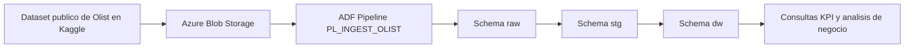

# Proyecto Data Warehouse de Olist

Este proyecto recrea un flujo de datos de extremo a extremo a partir del dataset publico de Olist disponible en Kaggle. La solucion fue construida como proyecto de portafolio con el objetivo de demostrar una implementacion completa de ingesta, limpieza, transformacion, modelado dimensional y analisis de negocio usando SQL Server y Azure como punto de entrada para la carga inicial.

La idea central del proyecto fue no limitarse a consultar archivos planos o hacer analisis exploratorio aislado, sino simular una arquitectura mas cercana a un entorno analitico real. Para ello, los datos se organizaron en capas separadas con responsabilidades bien definidas: una capa `raw` para recibir la informacion tal como llega desde origen, una capa `stg` para limpiar y tipar los datos, y una capa `dw` para consolidar el modelo analitico final.

## Objetivo del proyecto

El objetivo principal fue construir un mini ecosistema de datos orientado a reporteria y analitica sobre el negocio de e-commerce de Olist. A nivel tecnico, el proyecto busca evidenciar capacidades en:

- diseno de pipelines de carga
- modelado por capas
- limpieza y normalizacion de datos
- transformaciones en T-SQL
- construccion de tablas dimensionales y de hechos
- definicion de metricas de negocio
- elaboracion de consultas analiticas para reporteria

A nivel de portafolio, el proyecto refleja una forma estructurada de trabajar datos: primero asegurando trazabilidad del dato crudo, luego aplicando reglas de calidad y finalmente exponiendo un modelo apto para responder preguntas del negocio.

## Contexto de la solucion

El dataset de Olist contiene informacion relacionada con clientes, ordenes, items, pagos, resenas, productos, vendedores y geolocalizacion. Aunque los datos son publicos y relativamente accesibles, no vienen listos para un consumo analitico directo. Existen diferencias de tipos de datos, abreviaturas de estados, nombres de ciudades inconsistentes, fechas en texto y relaciones que requieren transformacion para poder construir indicadores confiables.

Por esa razon, la solucion se planteo como un flujo ETL por capas:

1. La data se carga primero en tablas `raw`, preservando el formato original del origen.
2. Luego se mueve a tablas `stg`, donde se corrigen tipos de datos, formatos y valores.
3. Finalmente se carga a un esquema `dw`, donde la informacion queda organizada en dimensiones y hechos para analisis.
4. Sobre el modelo dimensional se ejecutan consultas de KPI y reporteria.

## Arquitectura general



Esta arquitectura responde a una logica simple pero muy util:

- `raw` protege la fidelidad del origen
- `stg` concentra la limpieza y normalizacion
- `dw` facilita el consumo analitico

Separar las capas mejora la mantenibilidad del proyecto, hace mas facil depurar errores y permite que cada paso tenga un proposito claro dentro del flujo.

## Tecnologias utilizadas

- SQL Server
- T-SQL
- Azure Data Factory
- Azure Blob Storage
- Kaggle como fuente del dataset publico de Olist

## Estructura del repositorio

```text
Olist/
|-- Create tables/
|   |-- Create Raw tables.sql
|   |-- Create Staging tables.sql
|   `-- Create Data warehouse tables.sql
|-- Functions/
|   `-- fn_clean_city.sql
|-- Insert data/
|   |-- insert_staging.sql
|   `-- insert_data_warehouse.sql
|-- olist_business_kpis.sql
`-- README.md
```

## Flujo de trabajo del proyecto

### Ingesta en Azure Data Factory

La carga inicial a la capa `raw` no se plantea solo como una importacion manual de archivos, sino como un pipeline formal de Azure Data Factory documentado en la definicion `PL_INGEST_OLIST`. Esto fortalece bastante el proyecto a nivel de portafolio porque muestra una preocupacion real por orquestacion, parametrizacion y reutilizacion del proceso de ingesta.

El pipeline `PL_INGEST_OLIST` tiene como objetivo cargar los archivos CSV del dataset de Olist desde almacenamiento en Azure hacia tablas del esquema `raw` en SQL Server. La logica se apoya en actividades `Copy`, un `ForEach` parametrizado y algunas reglas especificas para datasets que requieren tratamiento especial.

#### Actividades principales del pipeline

El pipeline contiene tres bloques relevantes:

- `CP_LOAD_REVIEWS_CLEAN`
- `CP_LOAD_TRANSLATION_CLEAN`
- `FE_LOAD_RAW_TABLES`

La secuencia definida actualmente es la siguiente:

1. Primero se ejecuta `CP_LOAD_REVIEWS_CLEAN`.
2. Luego corre `CP_LOAD_TRANSLATION_CLEAN`.
3. Finalmente se lanza `FE_LOAD_RAW_TABLES`, que itera secuencialmente sobre la lista de archivos genericos.

Esta estructura deja ver que no todos los archivos fueron tratados de la misma manera. Algunos requirieron una carga dedicada debido a particularidades del origen, mientras que el resto pudo resolverse con una logica parametrizada y reutilizable.

#### Carga especial de resenas

La actividad `CP_LOAD_REVIEWS_CLEAN` carga el archivo `olist_order_reviews_dataset.csv` hacia la tabla `raw.order_reviews`. Lo interesante aqui es que no usa solo conversion automatica, sino mapeos explicitos de columnas en el `TabularTranslator`.

Esto fue necesario porque el archivo de resenas trae una anomalia en el encabezado de una columna: `review_answer_timestamp` contiene un salto de linea residual al final del nombre. En la definicion del pipeline esto aparece como `review_answer_timestamp\r`.

Documentar esta actividad en el README es importante porque demuestra que el pipeline no solo mueve archivos, sino que tambien resuelve defectos concretos del origen durante la ingesta.

#### Carga especial de traduccion de categorias

La actividad `CP_LOAD_TRANSLATION_CLEAN` inserta el dataset de traduccion en `raw.product_category_name_translation`. Este archivo se trata por separado porque cumple un rol de referencia dentro del proyecto: no representa una transaccion del negocio, sino un catalogo que luego se utiliza para enriquecer la capa `stg` y la dimension de productos en `dw`.

En otras palabras, esta actividad prepara uno de los insumos mas importantes para estandarizar categorias y hacer el modelo final mas legible para analisis.

#### Carga generica y parametrizada del resto de tablas raw

La actividad `FE_LOAD_RAW_TABLES` encapsula un `ForEach` secuencial que recorre el parametro `file_list`. Dentro de ese bucle se ejecuta la actividad `CP_LOAD_GENERIC_CSV`, la cual reutiliza el mismo patron de copia para varios archivos del dataset.

Los archivos definidos actualmente en `file_list` son:

- `olist_orders_dataset.csv`
- `olist_customers_dataset.csv`
- `olist_order_items_dataset.csv`
- `olist_products_dataset.csv`
- `olist_order_payments_dataset.csv`
- `olist_sellers_dataset.csv`
- `olist_geolocation_dataset.csv`

Cada item de la lista incluye el nombre del archivo y la tabla destino. Con esto, el pipeline evita repetir una actividad `Copy` por cada CSV y deja la ingesta mas mantenible, mas limpia y mas facil de extender si en el futuro se agregan nuevas entidades.

#### Configuracion tecnica de las actividades Copy

En terminos operativos, el pipeline usa componentes y configuraciones que vale la pena destacar:

- origen `DelimitedTextSource`
- lectura desde Azure Blob Storage
- destino `SqlServerSink`
- modo de escritura `insert`
- `enableSkipIncompatibleRow` activado para tolerar filas problematicas
- conversion de tipos habilitada mediante `TabularTranslator`
- truncamiento permitido cuando es necesario
- logging de actividad habilitado con nivel `Warning`

Estas decisiones muestran un enfoque pragmatico de ingestion: priorizar la continuidad de la carga, registrar advertencias utiles y dejar que la limpieza mas semantica ocurra despues, en la capa `stg`.

### 1. Capa Raw: recepcion del dato original

La primera capa del proyecto esta disenada para recibir la data sin imponer demasiadas reglas de validacion en el momento de entrada. En [`Create tables/Create Raw tables.sql`](./Create%20tables/Create%20Raw%20tables.sql) se crean tablas como:

- `raw.customers`
- `raw.geolocation`
- `raw.order_items`
- `raw.order_payments`
- `raw.order_reviews`
- `raw.orders`
- `raw.products`
- `raw.sellers`
- `raw.product_category_name_translation`

En esta capa casi todas las columnas se definen como `VARCHAR`. Esta decision no es casual. En un proceso de ingesta inicial, almacenar temporalmente los datos como texto ayuda a:

- evitar fallos de carga por formatos inesperados
- conservar el dato original para auditoria o reprocesos
- desacoplar la ingesta de la transformacion

Esta decision tambien dialoga muy bien con el pipeline de Azure Data Factory. Al cargar primero a tablas flexibles en `raw`, el proceso reduce el riesgo de que la ingestion falle por problemas de tipado demasiado temprano, especialmente en archivos con detalles sucios o encabezados irregulares.

En otras palabras, la capa `raw` funciona como una zona de aterrizaje. Su prioridad es capturar la informacion del origen con la menor friccion posible, aunque todavia no sea adecuada para analisis.

### 2. Capa Staging: limpieza, conversion y estandarizacion

La segunda capa se define en [`Create tables/Create Staging tables.sql`](./Create%20tables/Create%20Staging%20tables.sql). Aqui ya no se replica simplemente el origen, sino que se modelan tablas con tipos de datos mas apropiados para trabajo analitico.

Por ejemplo:

- latitud y longitud pasan a `DECIMAL`
- precios y valores monetarios se llevan a `FLOAT`
- campos numericos como cantidades y secuencias se convierten a `NUMERIC`
- fechas y timestamps se convierten a `DATE` o `DATETIME`

Esta capa cumple una funcion clave: transformar un conjunto de archivos operacionales en un dataset estructurado, consistente y listo para integrarse en un modelo dimensional.

La carga desde `raw` hacia `stg` se realiza en [`Insert data/insert_staging.sql`](./Insert%20data/insert_staging.sql). Este script concentra gran parte de la logica de calidad de datos del proyecto y es el punto en el que la ingestion tecnica se convierte en transformacion analitica.

#### Transformaciones aplicadas en staging

Entre las transformaciones mas importantes se encuentran:

- conversion de tipos de datos con `TRY_CONVERT`
- redondeo de importes monetarios en precios y fletes
- normalizacion de nombres de ciudades
- traduccion y enriquecimiento de categorias de producto
- expansion de abreviaturas de estados de Brasil a su nombre completo
- limpieza de timestamps con caracteres invisibles o formatos problematicos

#### Limpieza de clientes

En la tabla de clientes se estandariza el formato de ciudad para mejorar la presentacion y consistencia de joins. Ademas, los codigos abreviados de estado se traducen a nombres completos como `Sao Paulo`, `Rio de Janeiro` o `Minas Gerais`.

Esto hace que el dato sea mas legible para analisis y evita que el consumo final dependa de diccionarios externos.

#### Limpieza geografica con funcion personalizada

Uno de los componentes mas interesantes del proyecto es la funcion [`Functions/fn_clean_city.sql`](./Functions/fn_clean_city.sql), creada para limpiar nombres de ciudades antes de cargar la tabla `stg.geolocation`.

La funcion `dbo.fn_clean_city` resuelve varios problemas de calidad del dataset:

- manejo de valores `NULL`
- eliminacion de patrones defectuosos
- reemplazo de caracteres especiales
- normalizacion de acentos
- eliminacion de numeros incrustados en nombres
- corte de texto por delimitadores como coma, parentesis o guion
- eliminacion de espacios duplicados
- limpieza de caracteres no alfabeticos al inicio

Este paso es muy importante porque la geolocalizacion suele traer valores con variaciones, errores tipograficos o ruido textual. Si esos nombres no se limpian, las relaciones con clientes o vendedores pueden quedar inconsistentes y el analisis geografico pierde calidad.

#### Limpieza de ordenes y resenas

Las ordenes y resenas contienen campos de fecha y hora que originalmente llegan como texto. En staging se convierten con `TRY_CONVERT` a tipos temporales validos. En el caso de las resenas, tambien se contempla la existencia de caracteres invisibles en el origen, eliminandolos antes de convertir el timestamp de respuesta.

Esto permite:

- calcular tiempos de entrega
- comparar fechas estimadas vs reales
- analizar momentos de compra
- relacionar experiencia del cliente con cumplimiento logistico

#### Traduccion de categorias de producto

Los productos se enriquecen usando la tabla `raw.product_category_name_translation`, la misma que fue cargada mediante la actividad dedicada `CP_LOAD_TRANSLATION_CLEAN` en Azure Data Factory. Esto permite pasar de nombres de categoria originales en portugues a una representacion mas interpretable para usuarios de negocio o analistas que prefieran nomenclatura en ingles.

Adicionalmente, el script deja documentado que hubo categorias faltantes que debieron agregarse manualmente, lo cual es una senal positiva desde el punto de vista de portafolio: muestra que no solo se ejecuto una carga automatica, sino que tambien se detectaron y resolvieron pequenos vacios del origen.

### 3. Capa Data Warehouse: modelo dimensional para analitica

La capa final se define en [`Create tables/Create Data warehouse tables.sql`](./Create%20tables/Create%20Data%20warehouse%20tables.sql). Aqui el proyecto da el salto desde una estructura transaccional o intermedia hacia un modelo orientado a consulta.

El esquema `dw` incluye:

#### Dimensiones

- `dw.dim_customer`
- `dw.dim_product`
- `dw.dim_seller`
- `dw.dim_location`
- `dw.dim_date`

#### Tablas de hechos

- `dw.fact_orders`
- `dw.fact_order_items`

La razon de construir dimensiones y hechos es separar los atributos descriptivos de las metricas cuantitativas. Esto hace que el modelo sea mas facil de consultar, mas expresivo para reporteria y mas alineado con practicas clasicas de Business Intelligence.

### 4. Carga del Data Warehouse

La logica de insercion hacia el modelo final esta en [`Insert data/insert_data_warehouse.sql`](./Insert%20data/insert_data_warehouse.sql). Este script toma datos ya limpios desde `stg` y los convierte en estructuras analiticas listas para explotacion.

#### Dimension de clientes

`dw.dim_customer` concentra informacion clave del cliente como:

- `customer_id`
- `customer_unique_id`
- ciudad
- estado

Mas adelante, esta dimension se enriquece con `location_key`, conectandola con la dimension geografica para facilitar analisis territoriales.

#### Dimension de productos

`dw.dim_product` almacena el producto y su categoria. Aqui se consolida la relacion entre el identificador del producto y su clasificacion, habilitando consultas por categoria, top productos y analisis de contribucion al ingreso.

#### Dimension de vendedores

`dw.dim_seller` representa a los sellers con atributos de ciudad y estado. Igual que con clientes, luego se asigna una `location_key` para poder cruzar informacion comercial con perspectiva geografica.

#### Dimension de fechas

`dw.dim_date` se construye con un calendario generado por un CTE recursivo entre 2016 y 2020. Esta tabla es fundamental en cualquier warehouse porque evita recalcular atributos temporales en cada consulta y permite analizar con facilidad por:

- anio
- mes
- dia
- nombre del mes

#### Dimension de ubicacion

`dw.dim_location` agrupa informacion geografica por codigo postal, ciudad y estado, calculando ademas latitud y longitud promedio. Esta aproximacion resume multiples registros de geolocalizacion a una representacion mas estable para consulta.

#### Fact table de ordenes

`dw.fact_orders` resume la operacion a nivel de orden e incorpora metricas de negocio como:

- `total_order_value`
- `total_freight`
- `total_items`
- `delivery_days`
- `delivery_delay`
- `avg_review_score`

Esta tabla es especialmente valiosa porque integra datos de varias fuentes:

- ordenes
- items de orden
- resenas
- clientes
- productos
- vendedores
- fechas

El resultado es una vista consolidada de la compra, adecuada para medir revenue, volumen, experiencia del cliente y cumplimiento logistico.

#### Fact table de items

`dw.fact_order_items` conserva el detalle a nivel de item vendido. Aqui se almacenan:

- precio del item
- valor del flete
- valor total por item

Esto permite analisis mas finos, por ejemplo:

- categorias con mayor ingreso
- productos mas vendidos
- combinaciones de compra
- distribucion del ticket a nivel granular

### 5. Enlace geografico entre clientes, vendedores y ubicaciones

Un paso adicional del proyecto consiste en agregar `location_key` a las dimensiones de clientes y vendedores. Esta decision es importante porque desacopla la descripcion geografica del resto de atributos y deja preparado el modelo para analisis espaciales o regionales.

Gracias a este enlace se pueden construir vistas como:

- ventas por estado
- comparacion de gasto promedio por region
- concentracion geografica de clientes
- distribucion territorial de sellers

## Consultas de negocio y KPI

La capa analitica se documenta en [`olist_business_kpis.sql`](./olist_business_kpis.sql). En este archivo se agrupan consultas orientadas a reporteria y exploracion del desempeno del negocio.

El valor de esta capa es que transforma el modelo dimensional en respuestas concretas a preguntas de negocio. No se trata solo de almacenar datos correctamente, sino de habilitar analisis utiles para toma de decisiones.

### Principales frentes analiticos cubiertos

#### Revenue y crecimiento

Se incluyen consultas para:

- ventas por mes
- cantidad de ordenes por periodo
- ticket promedio
- crecimiento mensual porcentual

Estas metricas ayudan a entender la evolucion del negocio en el tiempo y detectar cambios de tendencia.

#### Desempeno logistico

Se analizan indicadores como:

- tiempo promedio de entrega
- porcentaje de entregas tardias
- tiempos de entrega por estado

Este bloque conecta el desempeno operativo con el impacto que puede tener en la experiencia del cliente.

#### Analitica de clientes

El archivo incorpora vistas de:

- top clientes por gasto
- Customer Lifetime Value
- cohortes de retencion
- segmentacion RFM
- churn de clientes
- tasa de recompra

Estas consultas permiten pasar de una lectura transaccional a una perspectiva de relacion con el cliente, identificando recurrencia, valor y riesgo de abandono.

#### Analitica de productos

Se contemplan consultas para:

- categorias con mayor revenue
- categorias mas vendidas
- ticket promedio por producto
- market basket analysis
- contribucion acumulada tipo Pareto

Con ello se puede entender mejor que productos impulsan la facturacion y cuales tienden a comprarse en conjunto.

#### Analitica de sellers

Tambien se incluyen indicadores para:

- top sellers por ingresos
- sellers con peor desempeno logistico

Esto ayuda a detectar tanto los principales aportantes al revenue como posibles focos de friccion operativa.

#### Satisfaccion del cliente

El proyecto relaciona score promedio de resenas con el tiempo de entrega y segmenta el cumplimiento logistico en categorias como:

- `On Time`
- `Slight Delay`
- `Severe Delay`

Esta combinacion es especialmente util porque vincula experiencia del cliente con variables operativas medibles.

#### Analisis geografico

El modelo soporta consultas como:

- ventas por estado
- segmentacion de clientes por ubicacion

Esto amplifica el valor de las tablas de clientes, sellers y geolocalizacion al integrarlas en un marco analitico unificado.

## Orden recomendado de ejecucion

Para reconstruir el proyecto desde cero, el orden sugerido es el siguiente:

1. Crear la base de datos `OlistDW` si todavia no existe.
2. Crear los esquemas `raw`, `stg` y `dw`.
3. Ejecutar [`Create tables/Create Raw tables.sql`](./Create%20tables/Create%20Raw%20tables.sql).
4. Ejecutar el pipeline `PL_INGEST_OLIST` en Azure Data Factory para cargar los archivos de origen hacia las tablas `raw`.
5. Ejecutar [`Functions/fn_clean_city.sql`](./Functions/fn_clean_city.sql).
6. Ejecutar [`Create tables/Create Staging tables.sql`](./Create%20tables/Create%20Staging%20tables.sql).
7. Ejecutar [`Insert data/insert_staging.sql`](./Insert%20data/insert_staging.sql).
8. Ejecutar [`Create tables/Create Data warehouse tables.sql`](./Create%20tables/Create%20Data%20warehouse%20tables.sql).
9. Ejecutar [`Insert data/insert_data_warehouse.sql`](./Insert%20data/insert_data_warehouse.sql).
10. Ejecutar [`olist_business_kpis.sql`](./olist_business_kpis.sql) para el analisis final.

## Que demuestra este proyecto

Este proyecto no solo muestra consultas SQL, sino una forma estructurada de pensar una solucion de datos completa. En particular, evidencia experiencia en:

- organizacion de datos por capas
- transformacion de datos crudos a modelos analiticos
- creacion de funciones reutilizables para calidad de datos
- integracion de dimensiones y hechos
- preparacion de datasets para reporteria
- construccion de metricas de negocio orientadas a decision

Tambien demuestra criterio en el tratamiento de problemas reales de datos, como:

- valores sucios o inconsistentes
- diferencias de formato entre tablas
- necesidad de homologar geografias
- enriquecimiento semantico de categorias
- consolidacion de eventos transaccionales en indicadores de negocio

## Posibles mejoras futuras

Como evolucion del proyecto, algunas mejoras naturales podrian ser:

- automatizar el pipeline completo de carga y refresco
- incorporar vistas o procedimientos almacenados para consumo recurrente
- agregar validaciones de calidad de datos por capa
- documentar volumenes de datos y tiempos de ejecucion
- conectar el warehouse a Power BI para visualizaciones ejecutivas
- incluir pruebas de reconciliacion entre `raw`, `stg` y `dw`

## Autor

Anthony Ccasani
